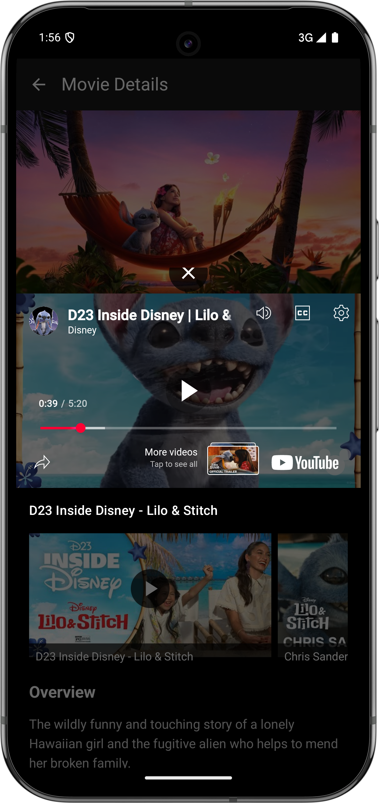

🎬 Snifflicks
Snifflicks is a modern movie listing app built using Jetpack Compose and structured around the MVI (Model-View-Intent) architecture. It showcases a clean, reactive UI with unidirectional data flow and state management best practices.

✨ Features
🔄 MVI Architecture – Predictable state management with clear separation of concerns
🧩 Jetpack Compose UI – Fully declarative, responsive UI
🎥 Movie listing with real-time updates
🔍 Search functionality
📱 Optimized for performance and scalability

🚀 Tech Stack
- Kotlin
- Jetpack Compose
- MVI Architecture
- Coroutines + Flow
- Retrofit
- Coil for image loading

🏗️ Architecture Overview
The app follows a custom implementation of the MVI (Model-View-Intent) architecture pattern with the following key components:

📦 Core Components
1. BaseViewModel<Event, Result, State>
   - Central component managing state and event handling
   - Located at: `app/src/main/java/com/amonga/snifflicks/core/compose/viewmodel/BaseViewModel.kt`
   - Handles event processing, state updates, and side effects

2. Base Interfaces
   - IEvent: Represents user actions or external events
   - IViewState: Immutable state container for UI rendering
   - IViewResult: Represents results of processing events
   - ISideEffect: Handles one-time actions like navigation or toasts

3. Base UI Components
   - ComposeBaseActivity: Base class for activities using MVI
   - ComposeBaseFragment: Base class for fragments using MVI

🔄 Data Flow
```
[User Action] -> [Event] -> [ViewModel] -> [ViewResult] -> [State] -> [UI]
                                      └-> [Side Effect] -> [One-time Action]
```

📐 Architecture Principles
1. Unidirectional Data Flow
   - Events flow from UI to ViewModel
   - State flows from ViewModel to UI
   - Side effects handle one-time actions

2. Immutable State
   - ViewState is immutable and represents the entire UI state
   - State changes are handled through reducer functions

3. Side Effects
   - Handled separately from state management
   - Used for navigation, toasts, and other one-time actions
   - Implemented using Kotlin Channels for reliable delivery

4. Coroutines & Flow
   - Events processed using SharedFlow
   - State managed using StateFlow
   - Side effects delivered via Channel

📝 Implementation Example
```kotlin
// Event handling in ViewModel
override suspend fun HandleEventScope.handleEvent(event: Event) {
    when (event) {
        is LoadData -> {
            ViewResult.Loading.reduceToState()
            try {
                val data = repository.getData()
                ViewResult.Success(data).reduceToState()
            } catch (e: Exception) {
                ViewResult.Error(e.message).reduceToState()
            }
        }
        is NavigateToDetail -> {
            SideEffect.NavigateToDetail(event.id).emit()
        }
    }
}

// State reduction
override fun ViewResult.reduce(oldState: State): State {
    return when (this) {
        is Loading -> oldState.copy(isLoading = true)
        is Success -> oldState.copy(isLoading = false, data = data)
        is Error -> oldState.copy(isLoading = false, error = message)
    }
}
```

📱 Screenshots
Here's a visual tour of the Snifflicks app:

| Screen | Description |
|--------|-------------|
|  | Splash screen with app branding |
|  | Secure password protection screen |
|  | Genre selection screen - initial state |
|  | Genre selection screen - with selections |
|  | Movie listing screen - loading state |
|  | Movie listing screen - main view |
|  | Movie listing screen - scrolled view |
|  | Detailed movie information screen |
|  | Integrated video player for trailers |
